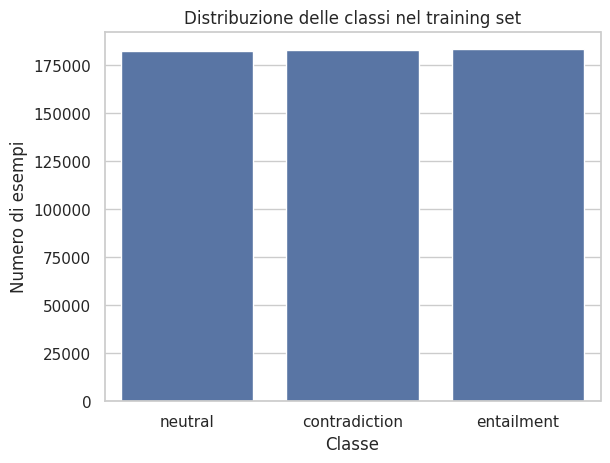
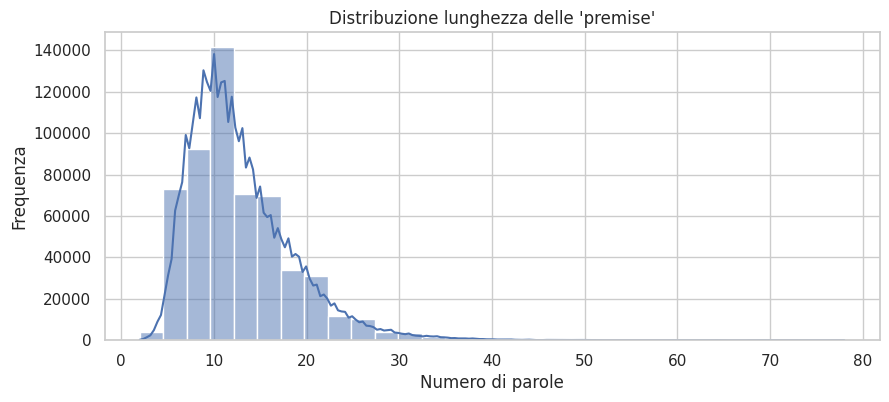
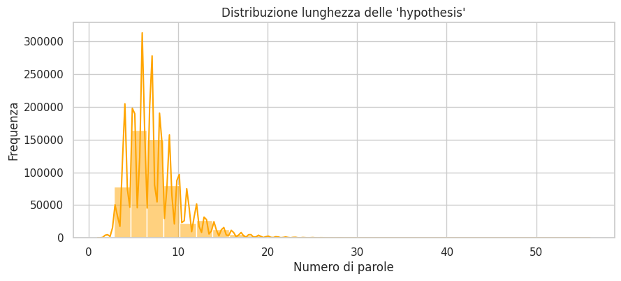
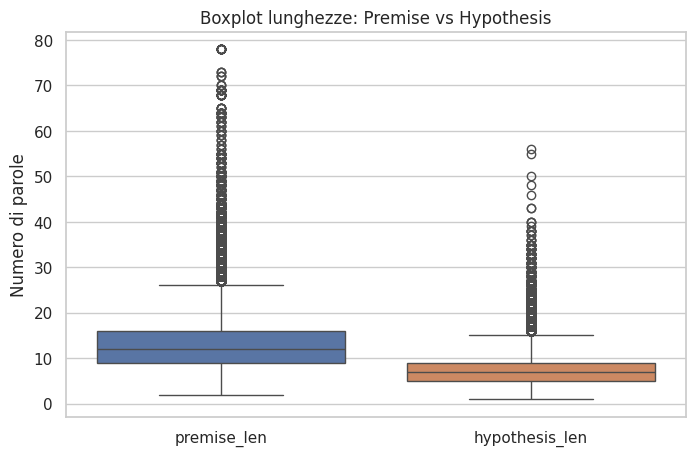
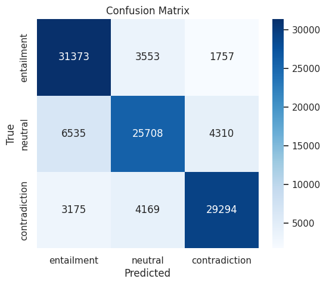

# Natural Language Inference using Deep Learning

Deep Learning project for **Natural Language Inference (NLI)** on the **Stanford Natural Language Inference (SNLI)** dataset.

The project implements and compares multiple neural network architectures for sentence-pair classification (**entailment**, **neutral**, and **contradiction**), starting with a baseline LSTM and progressively improving performance through BiLSTM, CNN, and MLP-based architectures.

---

## Project Overview

The notebook implements a complete Deep Learning pipeline for Natural Language Inference, including:

- Exploratory Data Analysis (EDA)
- Text preprocessing
- Tokenization and sequence padding
- Vocabulary creation
- Word Embeddings
- LSTM baseline
- Bidirectional LSTM (BiLSTM)
- CNN for text classification
- MLP classification heads
- Model comparison
- Performance evaluation
- Confusion Matrix analysis

---

## Dataset

- **Dataset:** Stanford Natural Language Inference (SNLI)
- **Task:** Three-class sentence pair classification
- Classes:
  - Entailment
  - Neutral
  - Contradiction

---

## Technologies

- Python
- TensorFlow / Keras
- NumPy
- Pandas
- Scikit-learn
- Matplotlib
- Seaborn

---

## Models Implemented

- LSTM
- BiLSTM
- Optimized BiLSTM
- CNN
- CNN + MLP
- BiLSTM + MLP (Final Model)

---

# Exploratory Data Analysis

## Class Distribution

The training dataset is well balanced across the three NLI classes.

---

## Premise Length Distribution

Most premises contain approximately 8–15 words.

---

## Hypothesis Length Distribution

Hypotheses are generally shorter than premises.

---

### Sentence Length Comparison

The boxplot highlights the differences between premise and hypothesis sentence lengths.

---

### Final Results

The best-performing architecture is the **BiLSTM + MLP** model, which achieves the highest overall accuracy among all tested architectures.

---

### Final Confusion Matrix

The confusion matrix shows strong predictive performance across all three NLI classes.

---

## Additional Figures

The repository also contains additional visualizations in the `images/` folder, including:

- LSTM Confusion Matrix
- BiLSTM Confusion Matrix
- Optimized BiLSTM Confusion Matrix
- CNN Confusion Matrix
- CNN + MLP Confusion Matrix

These figures document the progressive improvement obtained throughout the project.

---

## Author

**Sofia Rubini**

Bachelor's Degree in Philosophy and Artificial Intelligence  
Sapienza University of Rome
